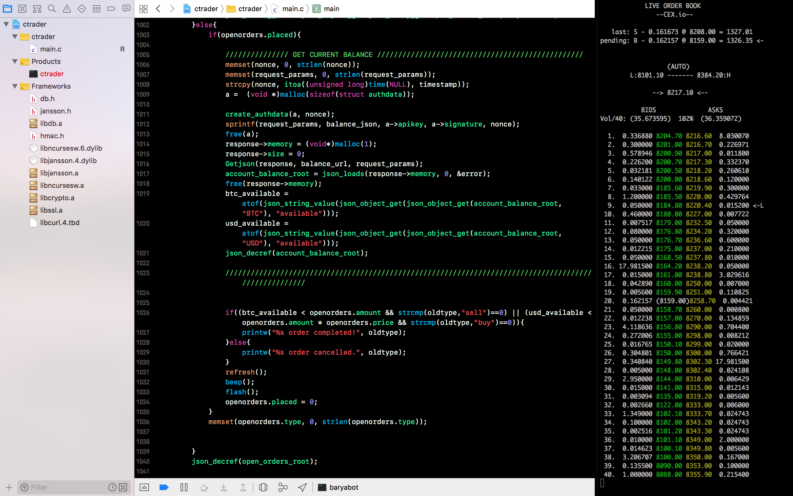

# ctrader
Crypto Trading Console App written in C

This program was written in C and uses Curl and Jansson libraries to interact with exchange APIs and process json data while BerkeleyDB embedded database library was used for persistence.

It allows you place your bid easily and jump around the order book by just entering your desired trade price or a specific index number. Orders can be auto adjusted and "locked" into position which works like a traditional "trailing stop loss" but without the risk of "slippage".

## Features:
* Supports multiple exchanges (in progress, currently supports CEX.io)
* Supports multiple crypto-currencies (in progress, currently supports bitcoins)
* Quick bid/sell using spacebar key
* Quick cancel bid/sell using 'esc' key
* View trades history using 'h' key. Profitable trades are highlighted in green.
* Jump around order book using up/down arrow keys or number + 'j' or 'k' (ala Vi)
* Auto-bump bid/sell price to maximize profit - e.g., default bid 'lock' is at the 5th position, once all orders above are fulfilled, ctrader bumps down the price to maintain 5th position. Order will only be fulfilled if someone (e.g., algo-trading bot) scoops a huge portion of the order book)

## TODO:
* move authentication data to a config file (yaml) (currently hard-coded)
* move all API urls to database (currently hard-coded)
* add support for other crypto exchange (need to register an account first)
* fix memory leaks (e.g., libjansson) - update or replace?
* move functions into a header file (ctrader.h)
